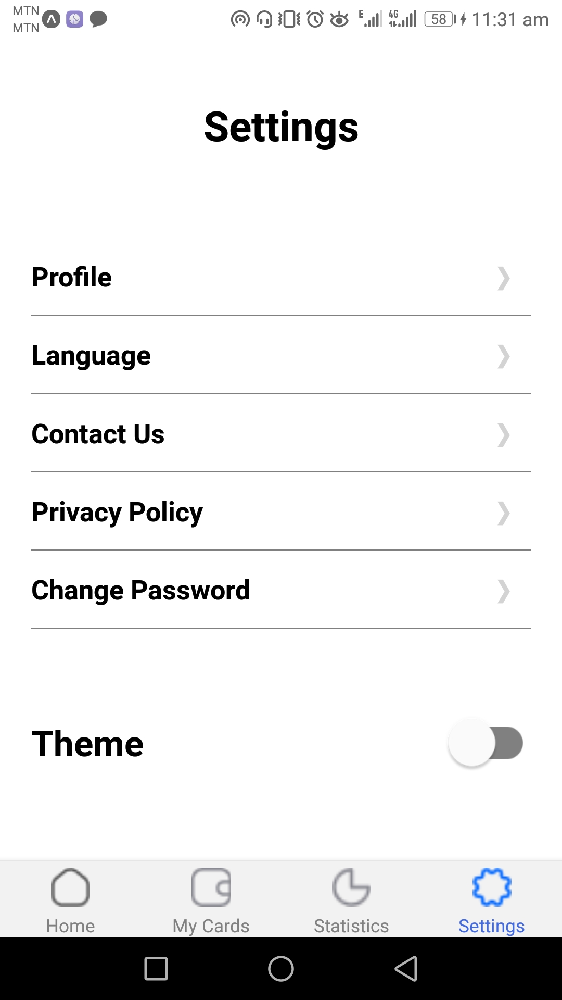

# rn-assignment5-11222100

This is a simple React Native application using `@react-navigation/bottom-tabs` for tab navigation and a custom `ThemeProvider` for theming. The app includes several screens and utilizes local images for tab icons.
      
## Screenshots

## Home Page

<p align="center">

| Dark Home Page                          | Light Home Page                         |
|---------------------------------|---------------------------------|
|  |  |

</p>

## Settings Page
<p align="center"> 

| Dark Settings Page                          | Light Settings Page                          |
|---------------------------------|---------------------------------|
|  |  |

</p>

## My Cards Page
<p align="center"> 

| Dark My Cards Page                      | Light My Cards Page          |
|---------------------------------|---------------------------------|
|  |  |

</p>

## Statistics
<p align="center"> 


| Dark Statistics Page                | Light Statistics Page                         |
|---------------------------------|---------------------------------|
|  |  |

</p>

---

## Features

- Tab navigation with icons and labels
- Dark and light theme support using `ThemeProvider`
- Screens:
  - Home
  - My Cards
  - Statistics
  - Settings

## Installation

1. Clone the repository:
```zsh
git clone https://github.com/St-Programming-Sai/rn-assignment5-11222100.git
```


2. Navigate to the project directory:
```zsh
cd rn-assignment5-11222100
```


3. Install dependencies:
```zsh
npm install
```


## Usage

Run the app on an Android or iOS emulator:
```zsh

npm run android
```

or

```zsh
npm run ios
```

## Dependencies

- `@react-navigation/native`
- `@react-navigation/bottom-tabs`
- `react-native`

## Theming

The app supports both light and dark themes. The theme is controlled by the `ThemeProvider` component located in `./components/ThemeContext.js`.

